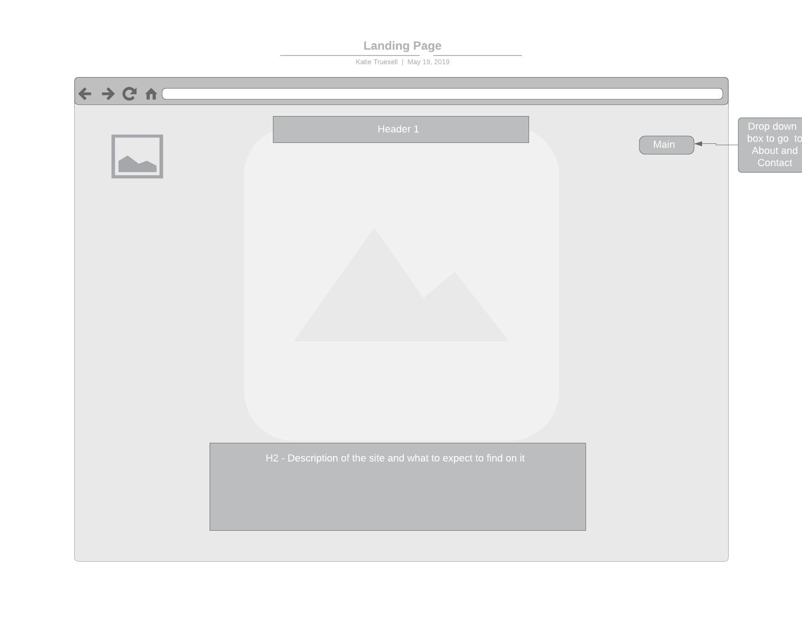
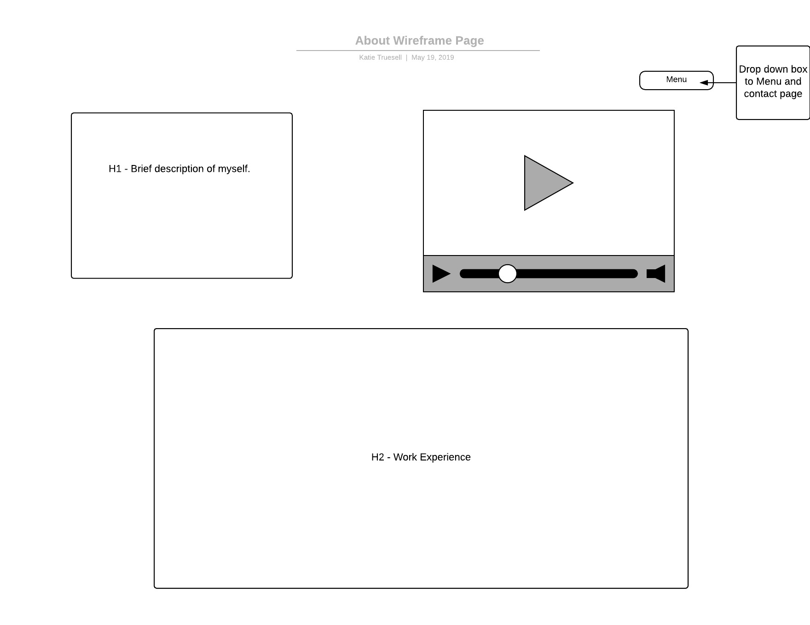
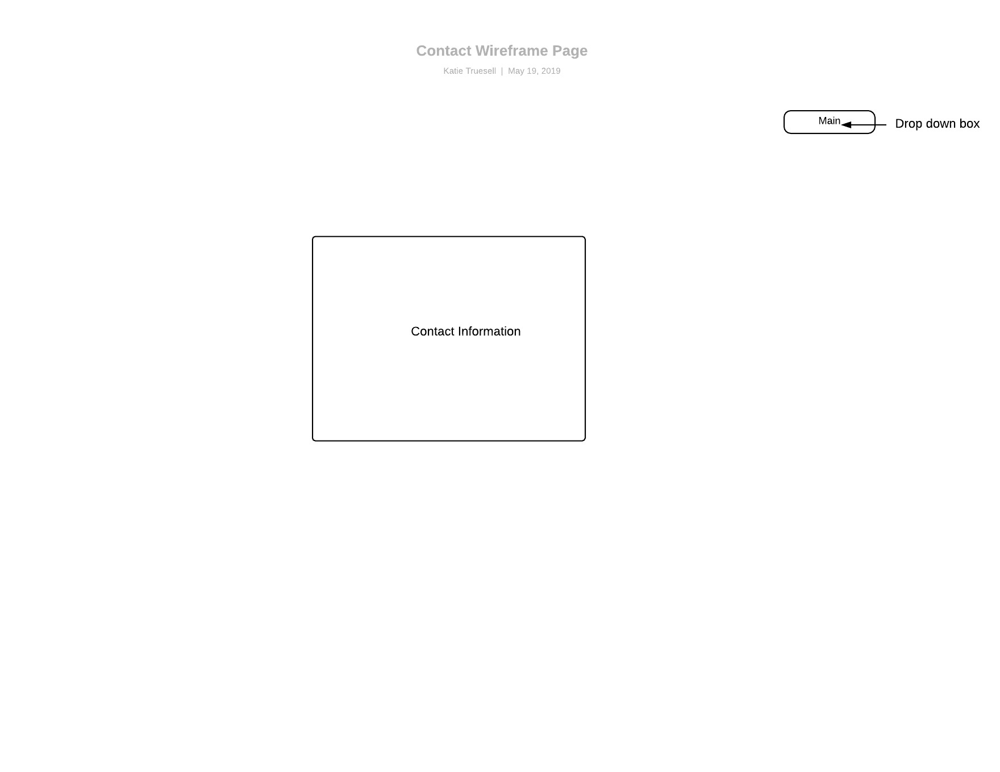

# My INF 7420 Project

I am going to create a portfolio website. The purpose of this website is to showcase my work to future employers. 

## Wireframes

To help with the design of my website, I have created some wireframes to give me a baseline for my layouts. 

Header - my name and navigation menu

Navigation Menu - will include links to other pages such as contact information and a page about myself

Main Content - my work objective along with highlighting my key skills

Footer - will include any copyright information

Header - navigation menu

Navigation Menu - will include links to other pages such as contact information and home page

Main Content - brief description about myself including the Youtube video and then my work history

Footer - will include any copyright information

Header - navigation menu

Navigation Menu - links to the home page and about page

Main Content - my email address for contacting me

Footer - will include any copyright information